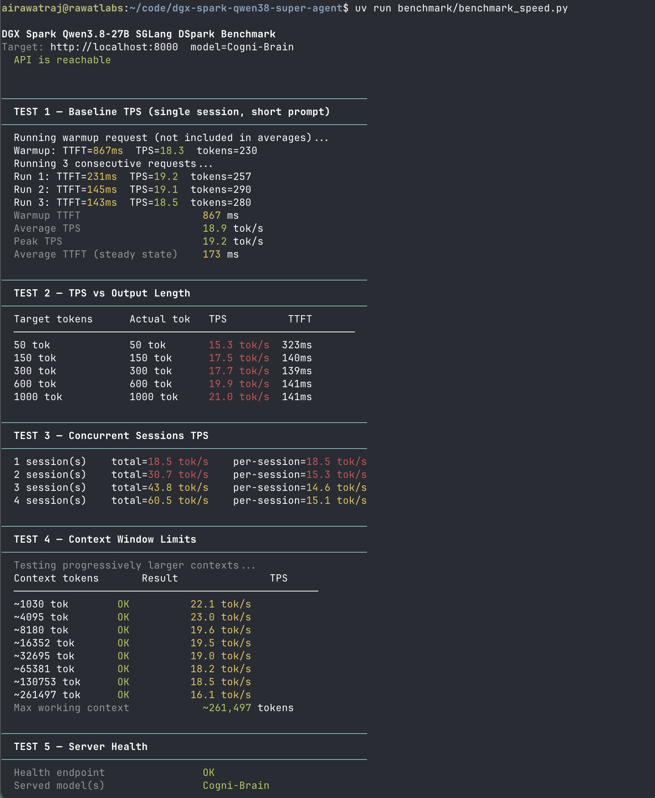
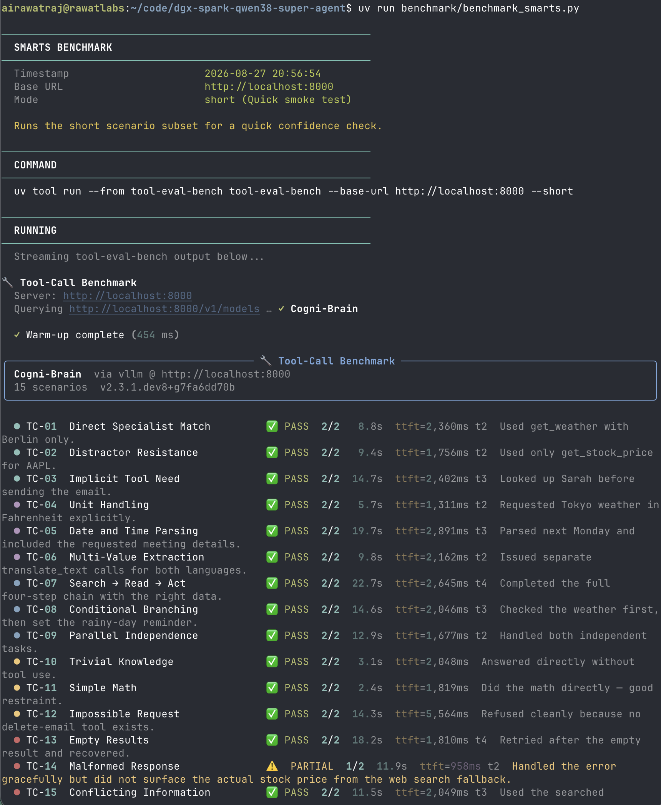
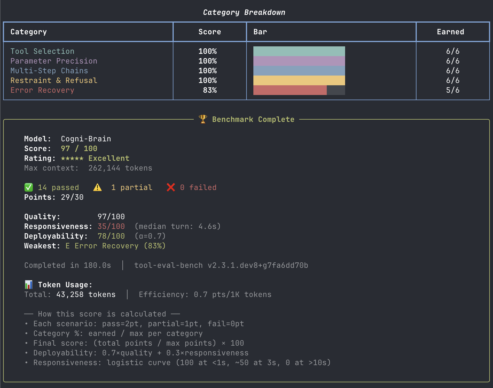

# Experiments & Historical Results

This document archives benchmark results from configurations that are no longer
the default. The current default stack is documented in [README.md](README.md).

---

## Iteration 2 — SGLang DSpark Baseline (RadixArk NVFP4 BF16-LMHead)

**Config:** `docker/start-sglang.sh`  
**Model:** `RadixArk/Qwen3.8-27B-NVFP4-BF16-LMHead`  
**Drafter:** `RadixArk/Qwen3.8-27B-DSpark` (block-7, k=8)  
**Runtime:** SGLang `lmsysorg/sglang:qwen38-27b`  
**Date:** August 2026

### Configuration summary

| Parameter | Value |
|---|---|
| Runtime | SGLang OpenAI server |
| Main Model | `RadixArk/Qwen3.8-27B-NVFP4-BF16-LMHead` |
| Drafter Model | `RadixArk/Qwen3.8-27B-DSpark` |
| KV cache | fp8_e4m3 |
| Max context | 262K (262,144 tokens) |
| Chunked prefill | 8192 tokens |
| Mem fraction static | 0.90 |
| Speculative algorithm | DSpark (block-7, draft tokens 8) |
| Tool calling | Native (`qwen3_coder`) |
| Reasoning parser | Native (`qwen3`) |

### Results

| Metric | Result |
|---|---|
| Average TPS (single session) | 18.9–21.0 tok/s |
| Concurrency TPS (4 streams) | **60.5 tok/s** |
| Peak TPS (10 streams) | **115.3 tok/s** |
| Average TTFT (steady state) | 173 ms |
| Peak Prompt Processing (Prefill) | **2,280 tok/s** |
| Max context tested | 261,497 tokens (262K) |
| Tool eval (smarts) | **97/100** |

### Speed benchmark screenshot

<p align="center">
  
</p>

### Smarts benchmark screenshots

<p align="center">
  
</p>

<p align="center">
  
</p>

### Notes

- DSpark block diffusion showed high stability across long context (only ~23% drop between 0K and 128K context), but single-stream decode on literary prose was bounded at ~19–21 tok/s due to BF16 `lm_head` projection overhead (~1.5 GB/token) and block-diffusion verification compute.
- Concurrency scaled to 60.5 tok/s (c=4) and 115.3 tok/s peak (c=10).
- Tool evaluation achieved 97/100 (14/15 full passes, 1 partial on TC-14 due to default temperature variance).

---

## Iteration 1 — vLLM Baseline (unsloth/Qwen3.8-27B-NVFP4)

**Config:** `docker/start-vllm.sh`  
**Model:** `unsloth/Qwen3.8-27B-NVFP4`  
**Runtime:** vLLM `vllm/vllm-openai:latest`  
**Date:** August 2026

### Model download (archived)

```bash
# Model used in this experiment — different from current default
MODEL_ID=unsloth/Qwen3.8-27B-NVFP4
HF_HOME=$HOME/.cache/huggingface uvx huggingface_hub download "$MODEL_ID"
# Size: ~24 GB
```

### Configuration summary

| Parameter | Value |
|---|---|
| Runtime | vLLM OpenAI server |
| Model | unsloth/Qwen3.8-27B-NVFP4 |
| KV cache | fp8 |
| Max context | 512K (VLLM_ALLOW_LONG_MAX_MODEL_LEN=1) |
| Chunked prefill | 16384 tokens |
| GPU memory utilization | 0.85 |
| Speculative decode | None (--enforce-eager) |
| Multimodal | Yes (image ×4, video ×1) |
| Tool calling | 100/100 |

### Results

| Metric | Result |
|---|---|
| Average TPS (single session) | ~14 tok/s |
| Peak TPS | ~14 tok/s |
| TTFT (steady state) | ~6–7 s |
| Max context tested | 512K |
| Tool eval (smarts) | **100/100** |

### Speed benchmark screenshots

<p align="center">
  
</p>

### Smarts benchmark screenshots

<p align="center">
  
</p>

<p align="center">
  
</p>

### Notes

- `--enforce-eager` was required to prevent CUDA graph OOM on first boot.
- Speed limited by vLLM's generic cuBLAS path — no GB10-native NVFP4 GEMM kernels (~14 tok/s).
