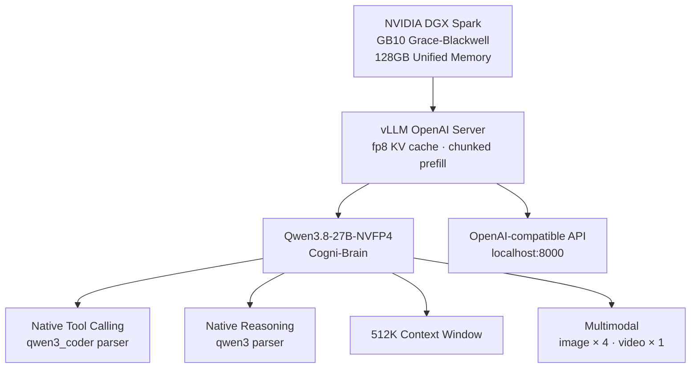
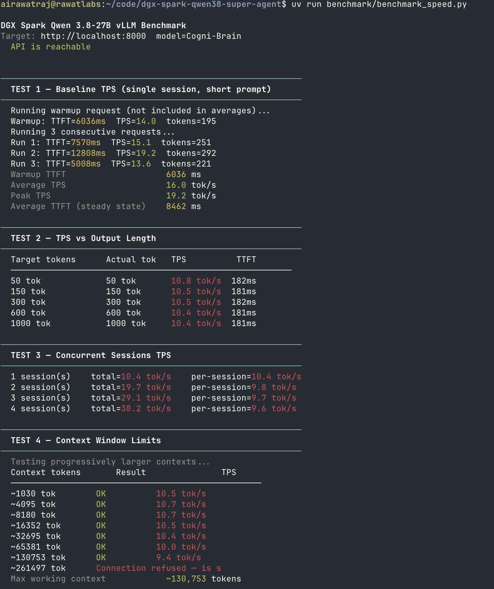

# Running a Real Local AI Agent on DGX Spark: Qwen3.8-27B via vLLM

I bought a DGX Spark to do real work: running serious local AI agents and training foundation models from scratch - not to run benchmarks.

*(If you are curious about the training side of this hardware, check out [SageGPT](https://github.com/airawatraj/sage-gpt), my 7.5M parameter Sanskrit SLM trained entirely from scratch on this same machine).*


This is my third DGX Spark local agent setup, following:
- [Cogni-Brain (Nemotron-120B)](https://github.com/airawatraj/dgx-spark-nemotron-super-agent) — deep reasoning, 23 TPS
- [Cogni-Brain-2 (Qwen 3.6-35B via Atlas)](https://github.com/airawatraj/dgx-spark-qwen-super-agent) — fast & agentic, 218 TPS

This iteration runs [unsloth/Qwen3.8-27B-NVFP4](https://huggingface.co/unsloth/Qwen3.8-27B-NVFP4) — the Unsloth-quantized Qwen 3.8 27B model — directly via the official **vLLM OpenAI-compatible server**. The goal: native tool-calling with the `qwen3_coder` parser, thinking/reasoning via `--reasoning-parser qwen3`, and a massive **512K token context window** — all on a single DGX Spark node.

> ⚠️ **Personal workstation setup. Not for enterprise use. Use at your own risk.**

---

## Why This Setup

### The Model

[Qwen3.8](https://qwenlm.github.io/blog/qwen3/) is a hybrid thinking/non-thinking model series. The 27B variant offers a strong balance of reasoning depth and agentic speed. With the NVFP4 quantization by Unsloth, it fits comfortably on the DGX Spark's 128GB unified memory.

**What makes this different from the previous Qwen setup:**

| Feature | Qwen 3.6-35B (Atlas) | Qwen3.8-27B (vLLM) |
|---|---|---|
| Runtime | Atlas (native NVFP4 kernels) | vLLM OpenAI Server |
| Tool calling | Via NemoHermes agent layer | **Native (`qwen3_coder`)** |
| Reasoning | Standard | **Native (`--reasoning-parser qwen3`)** |
| Context window | 131K | **512K** |
| Multimodal | No | **Yes (image ×4, video ×1)** |
| KV cache | NVFP4 | **fp8** |

### Architecture Overview



---

## Quick Start

> ⚠️ **Note:** The model will be downloaded automatically on first run via the Hugging Face cache mount. Ensure you have HF auth set up (`huggingface-cli login`) and enough disk space (~30GB for NVFP4 weights).

```bash
# 1. Verify prerequisites (Docker, uv/uvx, HF auth)
bash setup/install.sh

# 2. Launch spark-brain
bash docker/start.sh

# 3. Follow logs
docker logs -f spark-brain
# Wait for "Application startup complete" and "Uvicorn running on http://0.0.0.0:8000"
```

### Key flags explained

| Flag | Value | Reason |
|---|---|---|
| `VLLM_ALLOW_LONG_MAX_MODEL_LEN` | `1` | Required to unlock context lengths beyond vLLM's default safety cap |
| `--max-model-len` | `524288` | Full 512K context the model supports |
| `--kv-cache-dtype` | `fp8` | Reduces KV cache memory footprint |
| `--enable-chunked-prefill` | — | Processes long prompts in chunks; prevents OOM on 512K inputs |
| `--max-num-batched-tokens` | `16384` | Bounds each prefill chunk; tune down if you hit memory pressure |
| `--gpu-memory-utilization` | `0.85` | Leaves 15% headroom for OS and concurrent workloads |
| `--enforce-eager` | — | Disables CUDA graph capture; lowers VRAM overhead at startup |
| `--enable-auto-tool-choice` | — | Enables automatic tool call detection |
| `--tool-call-parser` | `qwen3_coder` | Parses Qwen3-coder-style tool call format |
| `--reasoning-parser` | `qwen3` | Extracts `<think>` blocks as reasoning content |
| `--limit-mm-per-prompt` | `{"image": 4, "video": 1}` | Caps multimodal inputs per request |

## Benchmark It

```bash
# Single-stream speed and context test
uv run benchmark/benchmark_speed.py

# Tool-use capability benchmark
uv run benchmark/benchmark_smarts.py

# Full spark-arena-style throughput sweep
uv run benchmark/benchmark_speed_arena.py --save-result benchmark/results_arena.csv
```

### Speed Results (512K context)

<p align="center">
  
</p>

### Smarts Results (Tool-Use Evaluation)

<p align="center">
  
</p>

<p align="center">
  
</p>

## Environment Overrides

Override any default before running `start.sh`:

```bash
export CONTAINER_NAME=spark-brain
export VLLM_IMAGE=vllm/vllm-openai:latest
export VLLM_PORT=8000
export MODEL_ID=unsloth/Qwen3.8-27B-NVFP4
export SERVED_MODEL_NAME=Cogni-Brain
export MAX_MODEL_LEN=524288
export GPU_MEMORY_UTILIZATION=0.85
export MAX_NUM_BATCHED_TOKENS=16384
export HF_CACHE_DIR=$HOME/.cache/huggingface
```

## Repository Structure

```text
dgx-spark-qwen38-super-agent/
├── README.md                ← this file
├── CITATION.cff             ← citation metadata
├── LICENSE                  ← MIT license
├── setup/
│   └── install.sh           ← verify Docker, uv/uvx, and Hugging Face auth
├── docker/
│   ├── start.sh             ← launch spark-brain with all optimized flags
│   ├── stop.sh              ← stop and remove the container
│   └── status.sh            ← health check and metrics
├── benchmark/
│   ├── benchmark_speed.py   ← TPS, TTFT, concurrency, and context benchmark
│   ├── benchmark_smarts.py  ← tool-eval-bench wrapper for capability checks
│   └── benchmark_speed_arena.py ← long spark-arena-style throughput sweep
└── assets/                  ← screenshots and benchmark result images
```

## Compared to Prior Published Results

| Who | Model | Runtime | TPS | Context |
|---|---|---|---|---|
| **[Cogni-Brain-2 (airawatraj)](https://spark-arena.com/benchmark/sub1779495971526)** | Qwen 3.6-35B | Atlas NVFP4 | **218.85** | 131K |
| **[Cogni-Brain (airawatraj)](https://spark-arena.com/benchmark/sub1778644062716)** | Nemotron-120B | vLLM NVFP4 | **23.45** | 131K |
| **Cogni-Brain (this repo)** | Qwen3.8-27B | vLLM fp8 | TBD | **512K** |

## Known Limitations

- `--enforce-eager` disables CUDA graph capture; this trades some peak throughput for lower memory overhead at startup. Remove it once you have confirmed the memory budget.
- `--max-num-batched-tokens 16384` is conservative. On a fully-dedicated DGX Spark with no other containers running, increasing this (e.g. to 32768) may improve throughput.
- The 512K context window is physically possible but will consume significant KV cache memory. At very long contexts, throughput will drop substantially. Use `--skip-context` in the speed benchmark if you just want TPS numbers.
- The benchmark wrappers resolve the latest available tool versions at run time. Pin them in `pyproject.toml` if you need reproducible numbers.
