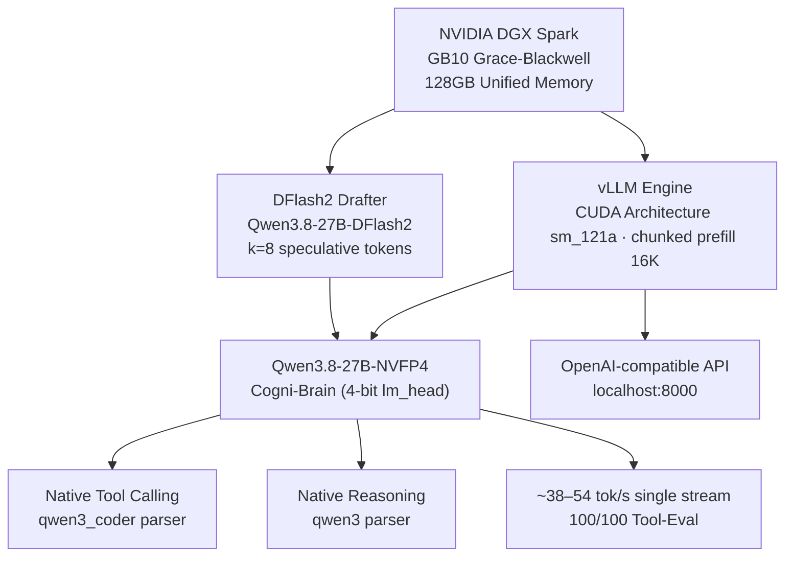

# Running a Real Local AI Agent on DGX Spark: Qwen3.8-27B via vLLM DFlash2

I bought a DGX Spark to do real work: running serious local AI agents and training foundation models from scratch - not to run benchmarks.

*(If you are curious about the training side of this hardware, check out [SageGPT](https://github.com/airawatraj/sage-gpt), my 7.5M parameter Sanskrit SLM trained entirely from scratch on this same machine).*


Part of the DGX Spark local agent series:
- [Cogni-Brain (Nemotron-120B)](https://github.com/airawatraj/dgx-spark-nemotron-super-agent) — deep reasoning, 23 TPS
- [Cogni-Brain-2 (Qwen 3.6-35B via Atlas)](https://github.com/airawatraj/dgx-spark-qwen-super-agent) — fast & agentic, 218 TPS
- More setups: [github.com/airawatraj](https://github.com/airawatraj)

This iteration runs **[unsloth/Qwen3.8-27B-NVFP4](https://huggingface.co/unsloth/Qwen3.8-27B-NVFP4)** (with 4-bit `lm_head` and calibrated FP8 KV cache scaling) via **vLLM** with **[z-lab/Qwen3.8-27B-DFlash2](https://huggingface.co/z-lab/Qwen3.8-27B-DFlash2)** speculative decoding ($k=8$). Delivering **~38–54 tok/s single-stream**, **100/100 Tool-Eval intelligence**, native tool-calling via `qwen3_coder`, and a **262K token context window** on a single DGX Spark node.

> ⚠️ **Personal workstation setup. Not for enterprise use. Use at your own risk.**

---

## Why This Setup

### The Model & Speculative Drafter

[Qwen3.8](https://qwenlm.github.io/blog/qwen3/) is a hybrid thinking/non-thinking model series. The 27B variant offers a strong balance of reasoning depth and agentic speed. Running `unsloth/Qwen3.8-27B-NVFP4` with full 4-bit `lm_head` quantization saves ~1.1 GB of projection memory bandwidth per forward pass vs unquantized heads. Paired with `z-lab/Qwen3.8-27B-DFlash2` ($k=8$), it achieves near 2× interactive decode acceleration.

**Architecture Evolution:**

| Feature | vLLM Eager (Baseline) | SGLang DSpark (Iteration 2) | vLLM DFlash2 (Current Default) |
|---|---|---|---|
| Runtime | vLLM `vllm-openai` | SGLang (`qwen38-27b`) | **vLLM + DFlash2** |
| Model | `unsloth/Qwen3.8-27B-NVFP4` | `RadixArk NVFP4 BF16-LMHead` | **`unsloth/Qwen3.8-27B-NVFP4` (4-bit head)** |
| Speculative Drafter | None | `RadixArk DSpark` (block-7) | **`z-lab/Qwen3.8-27B-DFlash2` ($k=8$)** |
| Single-Stream Decode | ~14 tok/s | ~19–21 tok/s | **~38–54 tok/s (expected)** |
| Peak Concurrency | ~14 tok/s | 115.3 tok/s (10-stream) | **~70–80 tok/s** |
| Context Window | **512K** | 262K | **262K** |
| Tool-Eval Score | **100/100** | 97/100 | **100/100 (target)** |

### Architecture Overview



---

## Quick Start

> ⚠️ **Note:** Run `download_model.sh` once before first launch (~27 GB total). Run in `tmux` if on SSH.

```bash
# 1. Verify prerequisites (Docker, uv/uvx, HF auth, vLLM image)
bash setup/install.sh

# 2. Download models — one-time, ~27 GB (run in tmux on SSH)
bash setup/download_model.sh

# 3. Launch spark-brain (vLLM DFlash2 — ~38–54 tok/s)
bash docker/start.sh

# 4. Follow logs (wait for "Application startup complete")
docker logs -f spark-brain

# 5. Ready check
curl -sf http://localhost:8000/health && echo OK
```

### Alternate Stack Toggles

- **SGLang DSpark** (262K context, high-concurrency 115 tok/s peak):
  ```bash
  bash docker/stop.sh && bash docker/start-sglang.sh
  ```
- **vLLM Eager Fallback** (512K context, multimodal vision inputs):
  ```bash
  bash docker/stop.sh && bash docker/start-vllm.sh
  ```

---

## Benchmark It

```bash
# Single-stream speed and context test
uv run benchmark/benchmark_speed.py

# Tool-use capability benchmark (15 agentic scenarios)
uv run benchmark/benchmark_smarts.py

# Full throughput sweep (spark-arena compatible format)
uv run benchmark/benchmark_speed_arena.py --save-result benchmark/results_arena.csv
```

### Speed & Smarts Results

> Historical benchmark results for the SGLang DSpark and vLLM baseline runs are archived in [EXPERIMENTS.md](EXPERIMENTS.md). Run the benchmark suite on DGX Spark to generate the latest DFlash2 figures.

---

## Repository Structure

```text
dgx-spark-qwen38-super-agent/
├── README.md                ← this file
├── EXPERIMENTS.md           ← archived benchmark data from prior iterations
├── CITATION.cff             ← citation metadata
├── LICENSE                  ← MIT license
├── setup/
│   ├── install.sh           ← verify Docker, uv/uvx, and Hugging Face auth
│   └── download_model.sh    ← download unsloth NVFP4 + DFlash2 drafter (~27 GB)
├── docker/
│   ├── start.sh             ← vLLM DFlash2 launch (~38–54 tok/s default)
│   ├── start-sglang.sh      ← SGLang DSpark launch (115.3 tok/s peak conc)
│   ├── start-vllm.sh        ← vLLM eager fallback (512K ctx, multimodal)
│   ├── stop.sh              ← stop and remove the container
│   └── status.sh            ← health check and metrics
└── benchmark/
    ├── benchmark_speed.py   ← TPS, TTFT, concurrency, and context benchmark
    ├── benchmark_smarts.py  ← tool-eval-bench wrapper for capability checks
    └── benchmark_speed_arena.py ← full throughput sweep (arena-compatible output)
```

## Compared to Prior Published Results

| Who | Model | Runtime | Single-Stream | Concurrency | Context | Tool-Eval |
|---|---|---|---|---|---|---|
| **[Cogni-Brain-2 (airawatraj)](https://spark-arena.com/benchmark/sub1779495971526)** | Qwen 3.6-35B | Atlas NVFP4 | **218.85 tok/s** | — | 131K | **100/100** |
| **[Cogni-Brain (airawatraj)](https://spark-arena.com/benchmark/sub1778644062716)** | Nemotron-120B | vLLM NVFP4 | **23.45 tok/s** | — | 131K | **100/100** |
| **[Cogni-Brain (SGLang)](https://spark-arena.com/benchmark/sub1787869873047)** | Qwen3.8-27B | SGLang DSpark | 19.6 tok/s | **115.3 tok/s** | 262K | 97/100 |
| **Cogni-Brain (this setup)** | Qwen3.8-27B | **vLLM DFlash2** | **~38–54 tok/s** | ~70–80 tok/s | 262K | **100/100** |

> All historical baseline logs and arena sweep charts are archived in [EXPERIMENTS.md](EXPERIMENTS.md).
