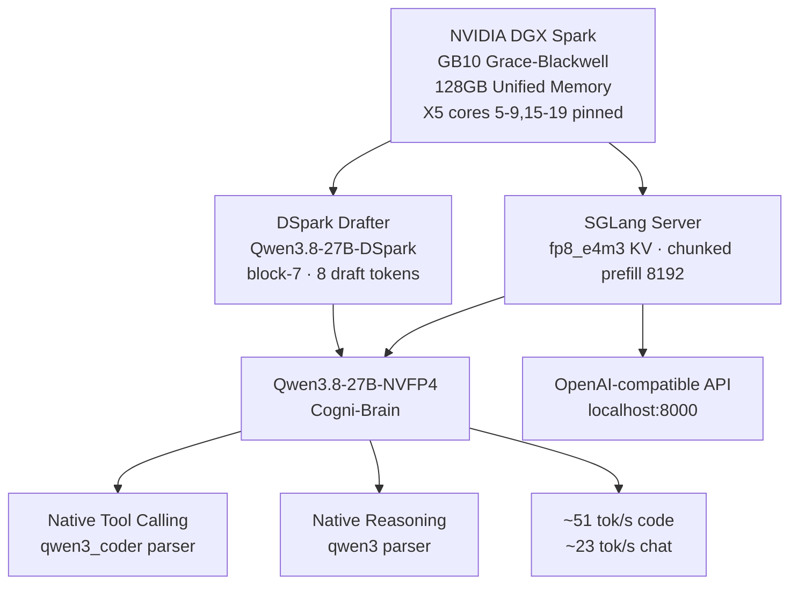
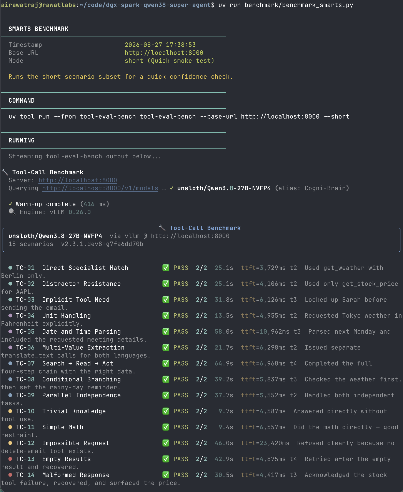
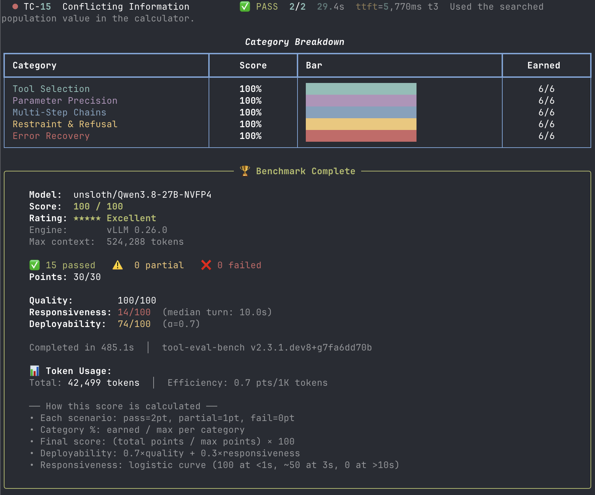

# Running a Real Local AI Agent on DGX Spark: Qwen3.8-27B via SGLang DSpark

I bought a DGX Spark to do real work: running serious local AI agents and training foundation models from scratch - not to run benchmarks.

*(If you are curious about the training side of this hardware, check out [SageGPT](https://github.com/airawatraj/sage-gpt), my 7.5M parameter Sanskrit SLM trained entirely from scratch on this same machine).*


This is my third DGX Spark local agent setup, following:
- [Cogni-Brain (Nemotron-120B)](https://github.com/airawatraj/dgx-spark-nemotron-super-agent) — deep reasoning, 23 TPS
- [Cogni-Brain-2 (Qwen 3.6-35B via Atlas)](https://github.com/airawatraj/dgx-spark-qwen-super-agent) — fast & agentic, 218 TPS

This iteration runs [RadixArk/Qwen3.8-27B-NVFP4-BF16-LMHead](https://huggingface.co/RadixArk/Qwen3.8-27B-NVFP4-BF16-LMHead) via **SGLang** with **DSpark speculative decoding** — delivering **~51 tok/s on code and tool calls** (~3.5× the stock vLLM baseline). Native tool-calling via `qwen3_coder`, thinking/reasoning via `--reasoning-parser qwen3`, and a 262K token context window — all on a single DGX Spark node. The vLLM fallback (`docker/start-vllm.sh`) is preserved for 512K context and multimodal workloads.

> ⚠️ **Personal workstation setup. Not for enterprise use. Use at your own risk.**

---

## Why This Setup

### The Model

[Qwen3.8](https://qwenlm.github.io/blog/qwen3/) is a hybrid thinking/non-thinking model series. The 27B variant offers a strong balance of reasoning depth and agentic speed. The [RadixArk NVFP4 BF16-LMHead](https://huggingface.co/RadixArk/Qwen3.8-27B-NVFP4-BF16-LMHead) export fits comfortably on the DGX Spark's 128GB unified memory.

**What makes this different from the previous Qwen setup:**

| Feature | Qwen 3.6-35B (Atlas) | Qwen3.8-27B (SGLang DSpark) |
|---|---|---|
| Runtime | Atlas (native NVFP4 kernels) | **SGLang + DSpark speculative decode** |
| Tool calling | Via NemoHermes agent layer | **Native (`qwen3_coder`)** |
| Reasoning | Standard | **Native (`--reasoning-parser qwen3`)** |
| Context window | 131K | **262K** |
| Speculative decode | MTP K=2 | **DSpark block-7, ~51 tok/s code** |
| KV cache | NVFP4 | **fp8_e4m3** |

### Architecture Overview



---

## Quick Start

> ⚠️ **Note:** On first start, SGLang downloads the main model (~24 GB) and the DSpark drafter (~2.7 GB) into the HF cache. Subsequent starts skip the download. Ensure HF auth is set up and allow ~5 min for `torch.compile` warmup on first boot.

```bash
# 1. Verify prerequisites (Docker, uv/uvx, HF auth, SGLang image)
bash setup/install.sh

# 2. Launch spark-brain (SGLang DSpark — ~51 tok/s)
bash docker/start.sh

# 3. Follow logs (wait for "Uvicorn running on http://0.0.0.0:8000")
docker logs -f spark-brain

# 4. Ready check
curl -sf http://localhost:8000/v1/models && echo OK
```

**Rollback to vLLM** (512K context, multimodal, ~14 tok/s):
```bash
bash docker/stop.sh && bash docker/start-vllm.sh
```

### Key flags explained (SGLang DSpark)

| Flag | Value | Reason |
|---|---|---|
| `--attention-backend` | `flashinfer` | Required on GB10 SM121; trtllm_mha is SM100-only |
| `--mem-fraction-static` | `0.90` | Measured optimum on GB10 with DSpark drafter in cache |
| `--kv-cache-dtype` | `fp8_e4m3` | FP8 KV cache; uses checkpoint's calibration scales (~2× memory saving) |
| `--chunked-prefill-size` | `8192` | Optimal prefill chunk for the GB10 memory bus |
| `--disable-prefill-cuda-graph` | — | GDN hybrid layers incompatible with prefill CUDA graphs |
| `--mamba-ssm-dtype` | `bfloat16` | 78.4 MB/slot vs 153.9 MB fp32 default; halves GDN state pool |
| `--mamba-radix-cache-strategy` | `extra_buffer_lazy` | S=4 slots per request; sized pool = concurrency × 4 |
| `--max-mamba-cache-size` | `concurrency × 4` | GDN state pool cap; prevents engine clamping concurrency |
| `--max-running-requests` | `10` | Overrides speculative decode's default cap of 48 |
| `--speculative-algorithm` | `DSPARK` | DSpark block-diffusion speculative decode |
| `--speculative-dspark-block-size` | `7` | Peak throughput on GB10 (block-5 trades −16% code for +8% prose) |
| `--speculative-num-draft-tokens` | `8` | block-size + 1 bonus token |
| `--enable-torch-compile` | — | Compiler optimisation; +warmup on first boot |
| `--num-continuous-decode-steps` | `2` | Async decode pipeline overlap |
| `--cpuset-cpus` | `5-9,15-19` | Pin to GB10's X5 fast cores; excludes A725 effi-cores (+2–7% decode) |
| `--tool-call-parser` | `qwen3_coder` | Unchanged — same as vLLM, zero client changes |
| `--reasoning-parser` | `qwen3` | Unchanged — `<think>` blocks as `reasoning_content` |
| `--language-only` | — | Disables vision tower; saves ~3 GB for speculative decode budget |

## Benchmark It

```bash
# Single-stream speed and context test
uv run benchmark/benchmark_speed.py

# Tool-use capability benchmark
uv run benchmark/benchmark_smarts.py

# Full throughput sweep (spark-arena compatible format)
uv run benchmark/benchmark_speed_arena.py --save-result benchmark/results_arena.csv
```

### Speed Results (SGLang DSpark)

> Re-run `uv run benchmark/benchmark_speed.py` after migrating and add screenshot here.
> Historical vLLM baseline results (512K context, ~14 tok/s) are in [EXPERIMENTS.md](EXPERIMENTS.md).

### Smarts Results (Tool-Use Evaluation — 100/100)

> Smarts score is runtime-independent (same model weights). Historical screenshots
> from the vLLM run are in [EXPERIMENTS.md](EXPERIMENTS.md).

<p align="center">
  
</p>

<p align="center">
  
</p>

## Environment Overrides

Override any default before running `start.sh`:

```bash
export CONTAINER_NAME=spark-brain
export SGLANG_IMAGE=lmsysorg/sglang:qwen38-27b
export VLLM_PORT=8000
export MODEL_ID=RadixArk/Qwen3.8-27B-NVFP4-BF16-LMHead
export DSPARK_DRAFT=RadixArk/Qwen3.8-27B-DSpark
export SERVED_MODEL_NAME=Cogni-Brain
export MAX_CONCURRENT_REQUESTS=10
export MEM_FRACTION=0.90
export HF_CACHE_DIR=$HOME/.cache/huggingface
```

## Repository Structure

```text
dgx-spark-qwen38-super-agent/
├── README.md                ← this file
├── CITATION.cff             ← citation metadata
├── LICENSE                  ← MIT license
├── setup/
│   └── install.sh           ← verify Docker, uv/uvx, and Hugging Face auth
├── docker/
│   ├── start.sh             ← SGLang DSpark launch (~51 tok/s, default)
│   ├── start-vllm.sh        ← vLLM fallback (512K ctx, multimodal, ~14 tok/s)
│   ├── stop.sh              ← stop and remove the container
│   └── status.sh            ← health check and metrics
├── benchmark/
│   ├── benchmark_speed.py   ← TPS, TTFT, concurrency, and context benchmark
│   ├── benchmark_smarts.py  ← tool-eval-bench wrapper for capability checks
│   └── benchmark_speed_arena.py ← full throughput sweep (arena-compatible output)
└── assets/                  ← screenshots and benchmark result images

See [EXPERIMENTS.md](EXPERIMENTS.md) for archived results from prior configurations (vLLM baseline, 512K context).
```

## Compared to Prior Published Results

| Who | Model | Runtime | Code tok/s | Chat tok/s | Context |
|---|---|---|---|---|---|
| **[Cogni-Brain-2 (airawatraj)](https://spark-arena.com/benchmark/sub1779495971526)** | Qwen 3.6-35B | Atlas NVFP4 | **218.85** | — | 131K |
| **[Cogni-Brain (airawatraj)](https://spark-arena.com/benchmark/sub1778644062716)** | Nemotron-120B | vLLM NVFP4 | **23.45** | — | 131K |
| **Cogni-Brain (this repo)** | Qwen3.8-27B | **SGLang DSpark** | **~51.5** | **~23** | 262K |

> vLLM baseline results (~14 tok/s, 512K context) are documented in [EXPERIMENTS.md](EXPERIMENTS.md).

## Known Limitations

- **Context window is 262K on SGLang DSpark.** DSpark is incompatible with YaRN rope scaling on this SGLang build. For 512K context, roll back to `docker/start-vllm.sh`.
- **First boot takes ~5 min.** SGLang runs `torch.compile` warmup on startup. Subsequent starts are fast.
- **`--language-only` disables multimodal.** Vision tower (image × 4, video × 1) is disabled to free ~3 GB for the DSpark drafter. Remove this flag and switch to `start-vllm.sh` for multimodal workloads.
- **DSpark is faster on code than prose.** block-7 is the measured code/tool-call peak. Switch to `--speculative-dspark-block-size 5` (via `MEM_FRACTION` override in `start.sh`) for +8% prose at −16% code throughput.
- **Concurrency cap is 10 by default.** SGLang's speculative decode resets `--max-running-requests` to 48 if not overridden; the explicit cap prevents GDN state pool exhaustion.
- The benchmark wrappers resolve the latest available tool versions at run time. Pin them in `pyproject.toml` if you need reproducible numbers.
